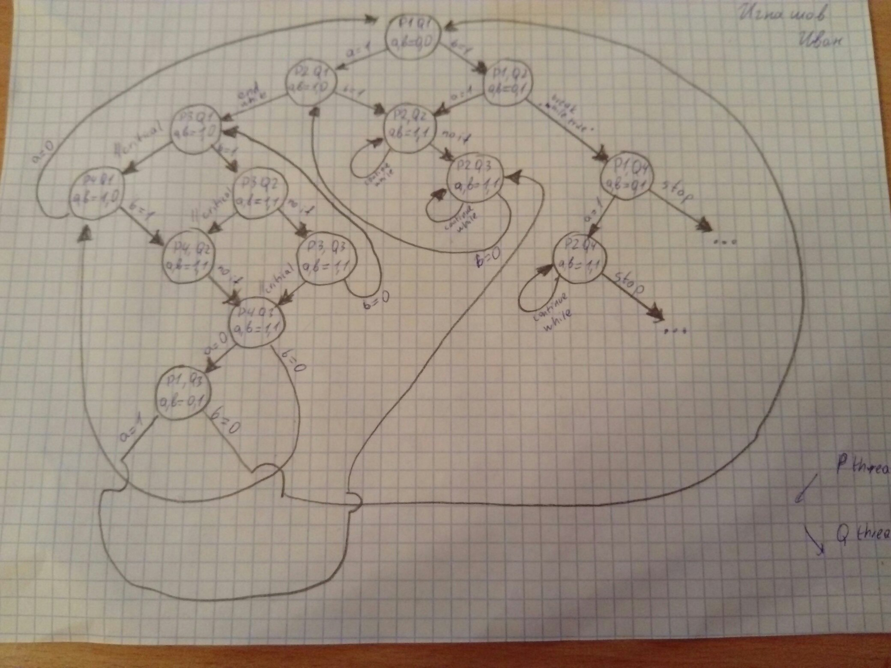

#### 1. Диаграмма исполнения в модели чередования операций

#### 2. Получилось 14 различных состояний

#### 3. Поток **P** не может находиться в состоянии *P3* (critical section) в то время, как поток **Q** находится в состоянии *Q4*

Если в какой-то программа зашла в Q4, значит, так как код в рамках одного треда исполняется последовательно, перед этим она была в состоянии Q2 со значениями а=0, b=1, но тогда, чтобы это получилось, тред P ещё не мог достичь строки а=1 (P1) и своего цикла на P2. Но в таком случае когда он туда "доберется", переменная b будет всегда иметь значение 1 (ведь после успешного if на Q2 в треде Q нет вариантов, как добраться до строки Q3), а значит он бесконечно, вне зависимости от времени дальнейшего исполнения Q4, будет крутиться в цикле P2.
Получается, ни при каких вариантах работы программы выполнить условие не получится.

#### 4. Состояние *Q4* достижимо из любых возможных состояний

Заметим, что внутри потока Q программа будет продолжать переходить на последующие строки при любых значениях shared переменных, так как нет ни циклов, ни переходов (кроме нужного), а значит в какие-то моменты времени может быть Q1 Q2 Q3 и значение b может становиться как 0, так и 1, независимо от треда P. При этом в треде P во время b=0, программа может выйти из бесконечного цикла P2 и попасть на строку a=0. Получается из любого состояния P можно добраться до состояния a=0, а т к тред Q независимо крутится в цикле while, то когда-нибудь настанет тот момент, что он будет на строке Q2 и перенестся на Q4.
